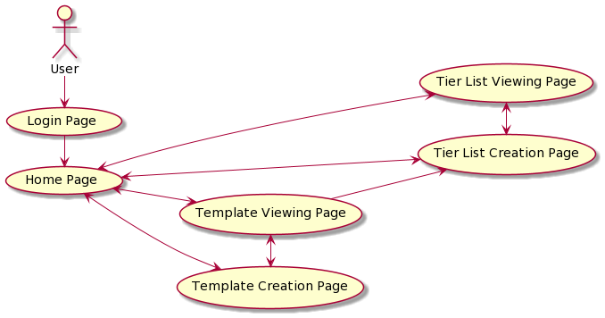
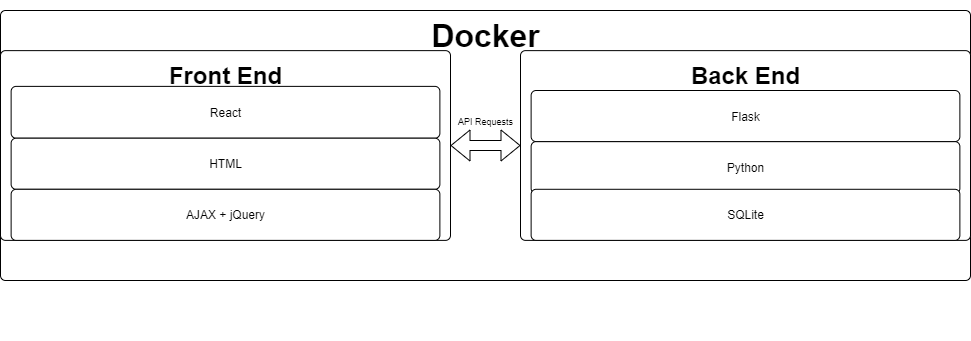
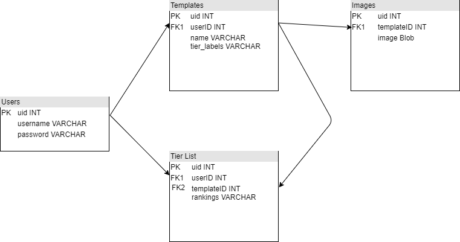

\pagebreak

## Introduction

A tier list is a subjective graphical representation of relative rankings between elements in the list.
TierHub is a web application for creating, viewing, and sharing Tier Lists.
Our application allows users to create personalized tier lists for any topic easily.
The sharing feature allows users to compare tier lists, and make their own changes to others tier lists.
TierHub addresses the problem of making personalized tier lists and storing them online.
 
## Problem solving and algorithms

One of the largest problems our application will need to solve is the management of user submitted images.
User submitted images will arrive in many different resolutions and formats, and our system will need to standardize and normalize all images for storage in the database as well as for display in our UI.

Another computational problem we our tackling is generating an average tier list derived from all user created tier lists of the same template. This will require computing the average ranks of all elements in each list and producing a tier list from that data.

The final problem we aim to solve is storing a complex multi-relational object (Tier Lists) into our database. We aim to solve this problem through proactive database design and intelligent data storage solutions.

## System Design

### Use Case Diagram

### Tech Stack

The entire application will exist within a docker container, allowing ease of deployement and maintenance.

#### Front End
The front end of our application will be written in React, and make API requests to our backend through AJAX http requests.

#### Back End
The back end of our application will run on a Flask instance that will both serve the front end webpages as well as respond to the front end's HTTP requests. The back end will also be responsible for querying and updating the database, along with authenticating users.

### Database Table Design

Our Database will be powered by SQLite and the design is as follows:

1. The Users table stores user login information: Username, and password.

2. The Templates table stores Template data:

    * userID of the person who created the template

    * name of the template

    * the labels for the different tiers included in their template.

3. The Tier List table stores Tier list information:

    * userID of the person who created the list

    * templateID for the template they used

    * rankings information which contains serialized information about the tiers and the images within each tier.

4. The Image table stores the images uploaded to the website:

    * templateID is a refeence to the template the image is for

    * A image field which contains the actual image stored in a Blob field.

## Milestones & Schedule
| Task ID | Description   |  Due date | Lead   |  
| :----:  | :------------ | :-----:   | :------: |  
|  1      | Implement database and write library for integrating with project | March 24th | Jake | 
|  2      | Write Flask API endpoints and logic for front end | March 26th | Levi |
|  3      | Implement inital front end (Rough UI) | March 26th | Jake + Levi |
|  4      | Clean up and improve front end | March 30th | Jake + Levi |
|  5      | Test and validate all use cases | April 1st | Jake  |
|  6      | Containerize / Dockerize Project | April 5th | Jake + Levi |
|  7      | Project submission | April 10th | Levi |
